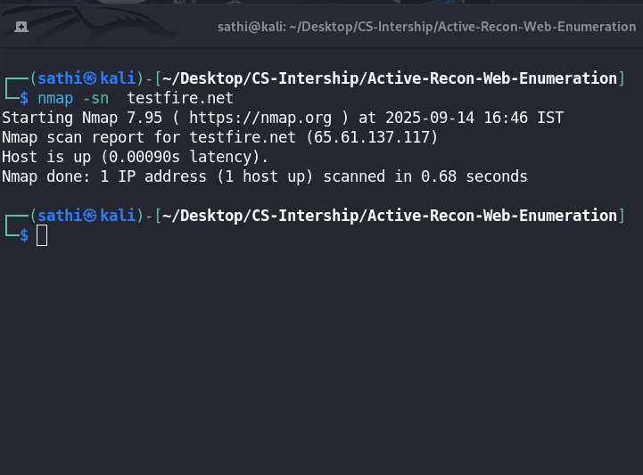
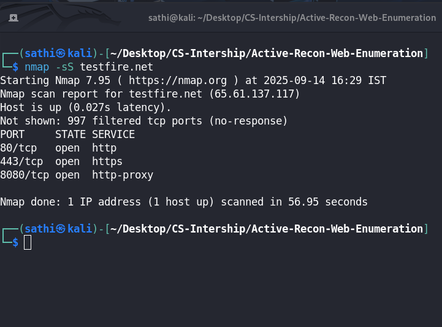
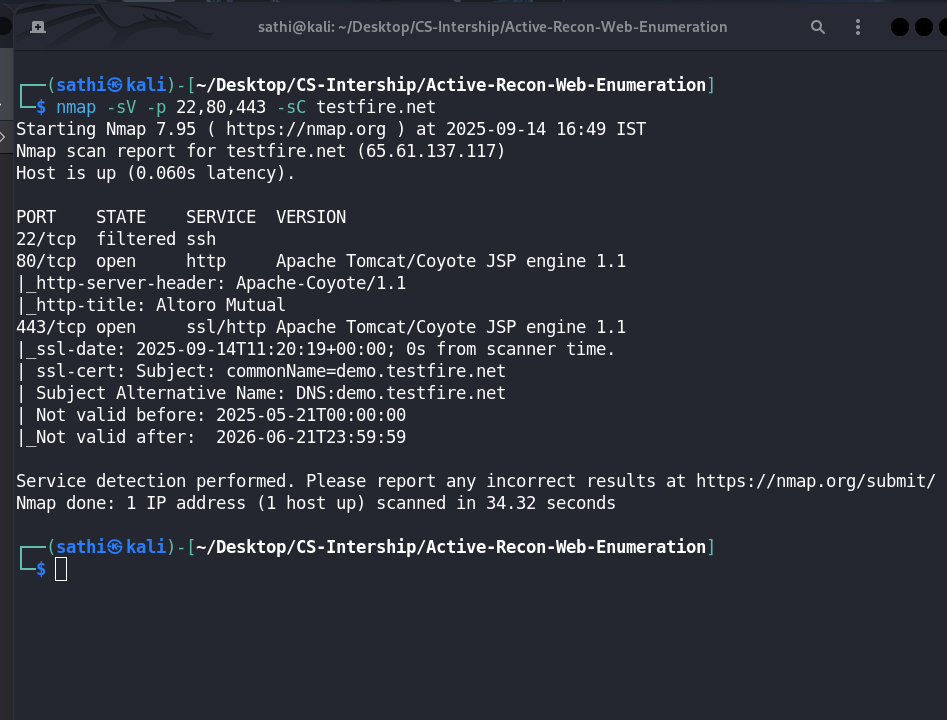
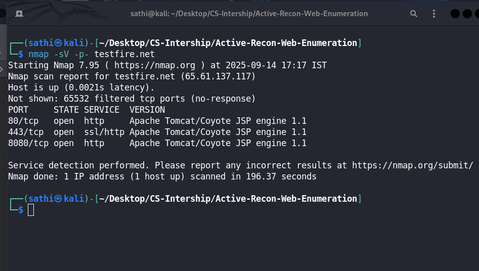
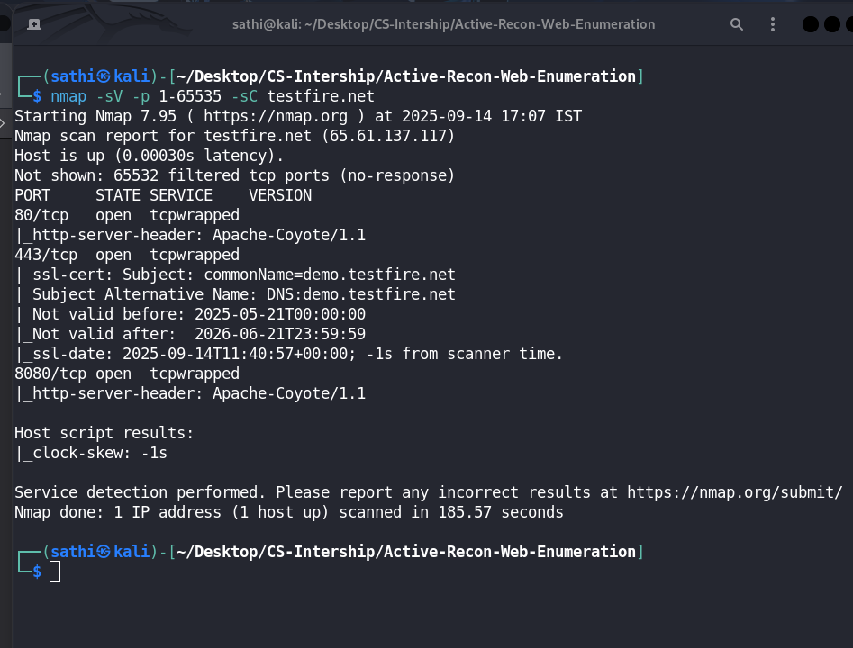
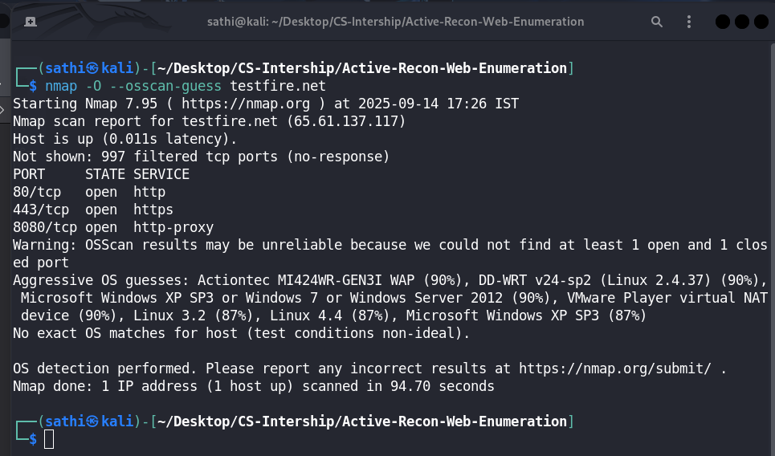
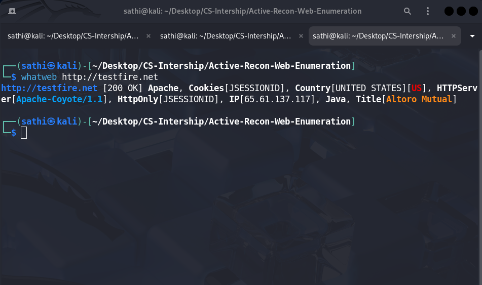
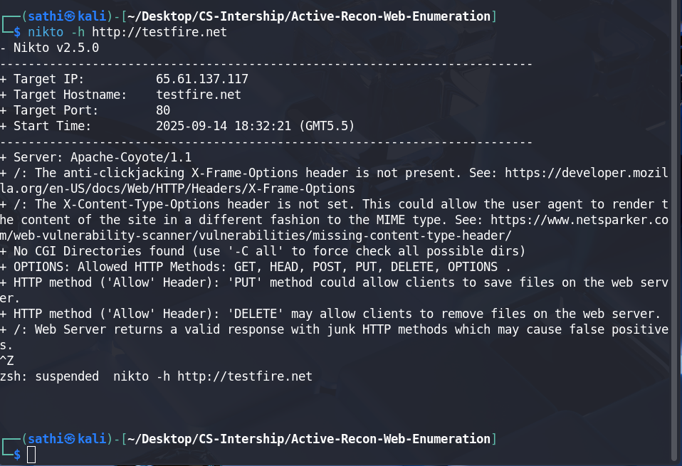
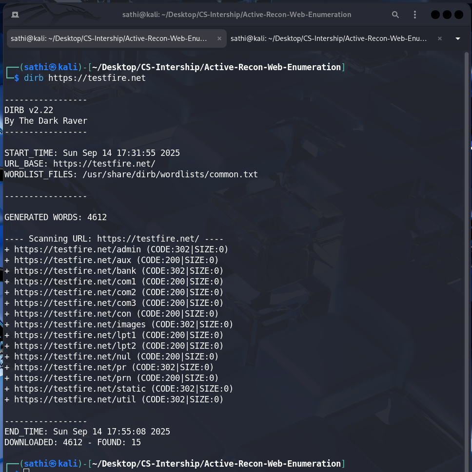

# Active Reconnaissance Report: testfire.net

## 1. Host Discovery

The first step was to confirm if the target host was online and to resolve its IP address. An Nmap ping scan (`-sn`) was used for this purpose.

**Command:**

```bash
nmap -sn testfire.net
```

**Results:**

- **Status:** Host is **UP**.
- **IP Address:** `65.61.137.117`

**Conclusion:** The target is live and accessible, allowing for further active scanning.



---

## 2. Port & Service Scan (Nmap)

A series of staged Nmap scans were conducted, progressing from quick discovery to more comprehensive analysis to build a detailed profile of the target's open ports and running services.

### a) Initial SYN Scan (`-sS`)

A fast TCP SYN scan was performed to quickly identify the most common open ports.

**Command:**

```bash
nmap -sS testfire.net
```

**Results:**

- **Port 80/tcp:** **OPEN** (http)
- **Port 443/tcp:** **OPEN** (https)
- **Port 8080/tcp:** **OPEN** (http-proxy)



### b) Service Version & Script Scan on Common Ports (`-sV -sC`)

A more detailed scan was run on the most likely ports to determine service versions and run default NSE scripts.

**Command:**

```bash
nmap -sV -p 22,80,443 -sC testfire.net
```

**Results:**

- **Port 22/tcp:** **FILTERED** (ssh) - This indicates that a firewall or network ACL is blocking direct access to the SSH port.
- **Ports 80 & 443/tcp:** Both ports are running **Apache Tomcat/Coyote JSP engine 1.1**.
- **SSL Certificate:** The certificate on port 443 is issued to `demo.testfire.net`, showing a name mismatch with the target domain.



### c) Comprehensive Full Port Scans

To ensure no services on non-standard ports were missed, exhaustive scans covering all 65,535 TCP ports were performed.

**Command 1: Full Port Service Scan (`-sV -p-`)**

```bash
nmap -sV -p- testfire.net
```

**Results:** This scan confirmed the findings from the initial scan, identifying the same three open ports (80, 443, 8080) and the Apache Tomcat/Coyote JSP engine 1.1 service. It also confirmed that the remaining 65,532 ports are filtered.



**Command 2: Full Port Service and Script Scan (`-sV -p 1-65535 -sC`)**

```bash
nmap -sV -p 1-65535 -sC testfire.net
```

**Results:** This deep scan classified the open ports as **`tcpwrapped`**, which suggests that connections are being proxied or inspected by a firewall. The `_clock-skew` NSE script also ran, indicating a negligible time difference.



### d) OS Detection (`-O`)

An attempt was made to identify the host's operating system.

**Command:**

```bash
nmap -O --osscan-guess testfire.net
```

**Results:** Nmap reported that the OS scan results were **unreliable** due to the presence of a firewall, which prevented it from getting the necessary responses to make an accurate determination.



---

## 3. Web Fingerprinting & Vulnerability Checks

`whatweb` and `nikto` were used to gather detailed information about the web application and check for common vulnerabilities.

### a) WhatWeb Results

**Command:**

```bash
whatweb http://testfire.net
```

**Results:**

- **Server:** Apache-Coyote/1.1
- **Technology:** Java, Apache
- **Cookies:** `JSESSIONID` (HttpOnly)
- **Title:** Altoro Mutual
- **Country:** UNITED STATES



### b) Nikto Scan Results

**Command:**

```bash
nikto -h http://testfire.net
```

**Results:**

- **Missing Security Headers:** The `X-Frame-Options` and `X-Content-Type-Options` headers are not set, indicating a potential risk of Clickjacking and MIME sniffing attacks.
- **Allowed HTTP Methods:** The server allows potentially dangerous HTTP methods: `GET, HEAD, POST, PUT, DELETE, OPTIONS`. The **`PUT`** and **`DELETE`** methods are particularly risky if misconfigured, as they could allow an attacker to upload or delete files on the server.
- **Server Banner:** Confirmed the server is `Apache-Coyote/1.1`.



---

## 4. HTTP Enumeration (Directory Brute-Forcing)

The `dirb` tool was used with its default `common.txt` wordlist to discover hidden or unlinked directories and files.

**Command:**

```bash
dirb https://testfire.net
```

**Discovered Directories & Files:**
The scan successfully identified 15 paths of interest:

- `https://testfire.net/admin` (CODE:302 - Redirect)
- `https://testfire.net/bank` (CODE:302 - Redirect)
- `https://testfire.net/images` (CODE:302 - Redirect)
- `https://testfire.net/static` (CODE:302 - Redirect)
- `https://testfire.net/aux` (CODE:200 - OK)
- `https://testfire.net/com1` (CODE:200 - OK)
- `https://testfire.net/con` (CODE:200 - OK)
- And several other unusual paths (`lpt1`, `prn`, `nul`, etc.) which could indicate an older or misconfigured system.



---

## 5. Conclusion & Identified Attack Surfaces

This active reconnaissance scan of `testfire.net` has revealed several key findings that form a clear picture of the target's potential weaknesses. The primary attack surfaces are:

1.  **Technology Stack:** The target is running an **Apache Tomcat/Coyote JSP engine 1.1**.

2.  **Exposed Administrative Interface:** The discovery of an `/admin` directory is a critical finding.

3.  **Insecure HTTP Methods:** The server has **`PUT`** and **`DELETE`** methods enabled.

4.  **Weak Security Configuration:** The lack of basic security headers (`X-Frame-Options`, `X-Content-Type-Options`) indicates a poor security posture and could make the application susceptible to client-side attacks.

