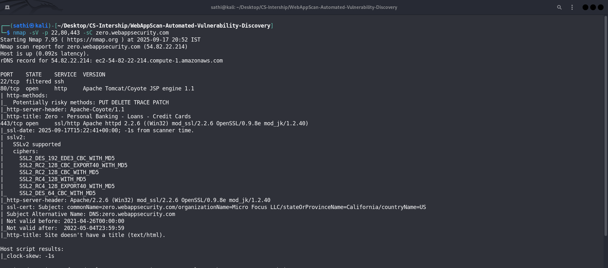

 Web Application Scanning Report: zero.webappsecurity.com

 1. Reconnaissance & Discovery

a) Nmap Scans - Host, Port, and Service Discovery

A series of Nmap scans were performed to build a profile of the target.

**Host Discovery (`-sn`):**
The target was confirmed to be online.
*   **IP Address:** `54.82.22.214`
*   **rDNS Record:** `ec2-54-82-22-214.compute-1.amazonaws.com`


**Port & Service Scan (`-sV -sC -p 22,80,443`):**
*   **Port 22/tcp:** **FILTERED** (ssh)
*   **Port 80/tcp:** **OPEN** (http) - Apache Tomcat/Coyote JSP engine 1.1
*   **Port 443/tcp:** **OPEN** (ssl/http) - Apache httpd 2.2.6 ((Win32) mod_ssl/2.2.6 OpenSSL/0.9.8e mod_jk/1.2.40)
*   **Port 8080/tcp:** **OPEN** (http-proxy) - Apache Tomcat/Coyote JSP engine 1.1
*   **Potentially Risky Methods Found:** `PUT`, `DELETE`, `TRACE`, `PATCH`



### b) Web Fingerprinting (WhatWeb & Wappalyzer)

The technology stack was identified using WhatWeb and Wappalyzer.

**WhatWeb Results:**
*   **Server:** Apache/2.2.6, Apache-Coyote/1.1
*   **Technology:** Java, Bootstrap, jQuery (1.8.2), Font Awesome
*   **Country:** UNITED STATES
*   **Title:** Zero - Personal Banking - Loans - Credit Cards


**Wappalyzer Results:**
*   **Programming Language:** Java
*   **Web Server:** Apache Tomcat
*   **UI Frameworks:** Bootstrap
*   **JavaScript Libraries:** jQuery 1.8.2


### c) Directory Discovery (Dirb)

The `dirb` tool was used to discover directories and files using the `common.txt` wordlist.

**Command:**
```bash

dirb http://zero.webappsecurity.com/
```

**Key Directories Found:**
*   `/admin` (CODE: 302)
*   `/cgi-bin/` (CODE: 403)
*   `/docs` (CODE: 302)
*   `/login.html` (Identified by Nikto)
*   `/manager` (CODE: 302)
*   `/server-status` (CODE: 200)

---

## 3. Automated Vulnerability Scanning Results

Light automated scans were performed using Nikto, Nuclei, and OWASP ZAP to identify common vulnerabilities and misconfigurations.

### a) Nikto Scan Results

Nikto was used to check for web server issues, missing headers, and other common vulnerabilities.

**Key Findings:**
*   **Missing Headers:** `X-Frame-Options` and `X-Content-Type-Options` are not present.
*   **Allowed HTTP Methods:** `PUT`, `DELETE`, and `PATCH` are enabled, which could be risky if not properly secured.
*   **Information Leak:** The server banner (`Apache/2.2.6 (Win32) mod_ssl/2.2.6 OpenSSL/0.9.8e mod_jk/1.2.40`) discloses specific version information.
*   **Exposed Paths:** Found `/server-status`, `/admin/`, `/readme.txt`, `/manager/html`, and a suspicious `#wp-config.php#` file, which could contain database credentials.

### b) Nuclei Scan Results

Nuclei was used for fast, template-based vulnerability checks.

**Key Findings:**
*   **Exposed Tomcat Manager:** Confirmed the presence of the public Tomcat Manager UI at `/manager/html` and the status page at `/manager/status`.
*   **Technology Detection:** Identified Apache, Tomcat (version 7.0.70), Bootstrap, and Font Awesome, corroborating the findings from other tools.

### c) OWASP ZAP Baseline Scan Results

The ZAP baseline scan was performed to passively identify vulnerabilities without launching active attacks.

**Summary of Alerts:**
*   **Medium Risk:** 4 Alerts (12 Instances)
*   **Low Risk:** 5 Alerts (30 Instances)
*   **Informational:** 4 Alerts (15 Instances)

**Key Medium-Risk Findings:**
1.  **Vulnerable JS Library:** ZAP identified `jquery-1.8.2.min.js` as vulnerable, citing multiple CVEs including **CVE-2020-11023 (XSS)**, **CVE-2020-11022 (XSS)**, and **CVE-2015-9251 (XSS)**. This is the most critical finding.
2.  **Content Security Policy (CSP) Header Not Set:** The lack of a CSP header makes the site more susceptible to Cross-Site Scripting (XSS) attacks.
3.  **Missing Anti-clickjacking Header:** The `X-Frame-Options` header is missing, making the site vulnerable to clickjacking attacks.
4.  **Cross-Domain Misconfiguration:** The `Access-Control-Allow-Origin` header is set to `*`, which allows any domain to make requests to the application. This is a significant security misconfiguration.

---

## 4. Conclusion & Identified Attack Surfaces


1.  **Outdated and Vulnerable Components:** The use of **jQuery 1.8.2** is the most critical issue, as it is vulnerable to multiple known XSS CVEs. 

2.  **Weak HTTP Header Security:** The absence of `Content-Security-Policy` and `X-Frame-Options` headers exposes the application to a range of client-side attacks, including XSS and clickjacking.

3.  **Information Leakage:** The server leaks detailed version information in its `Server` header (Apache 2.2.6, OpenSSL 0.9.8e, Tomcat 7.0.70).
4.  **Exposed Administrative Interfaces:** The `/admin` and `/manager/html` paths are high-value targets for brute-force and default credential attacks.
5.  **Risky HTTP Methods:** The enabled `PUT` and `DELETE` methods should be immediately investigated to determine if they allow unauthorized file modification or uploads on the server.


